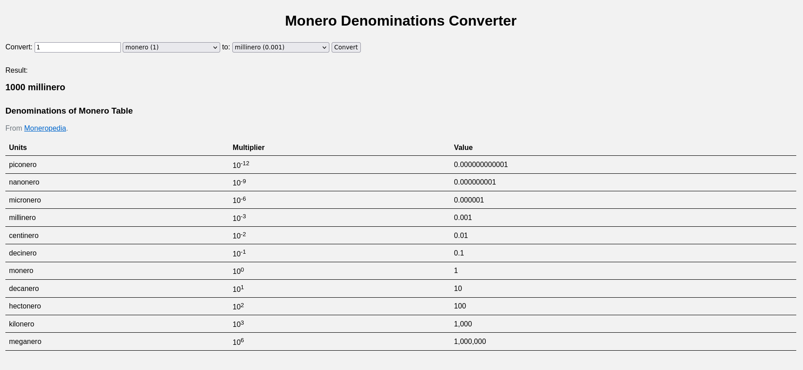

# Monero Denomination Converter

This is a simple web-based utility that allows you to conveniently convert between different denominations of Monero.

The denominations are taken from the [Moneropedia](https://www.getmonero.org/resources/moneropedia/denominations.html).

## Features

1. Simple and easy to use
2. Completely offline
3. Two-way conversion

## Preview

Here is a preview of the tool:

[Visit here](https://htmlpreview.github.io/?https://github.com/recanman/monero-denominations-converter/blob/main/index.html) for a live demo.

## License
This project is licensed under the MIT License. See the LICENSE file for details.

Feel free to contribute, suggest improvements, or report any issues.